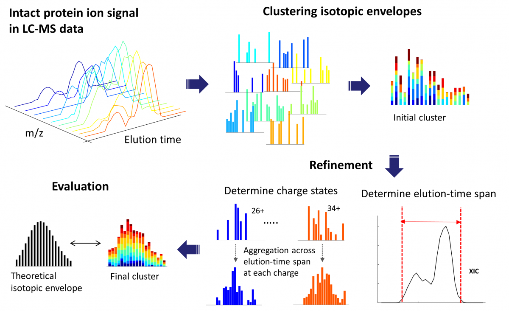
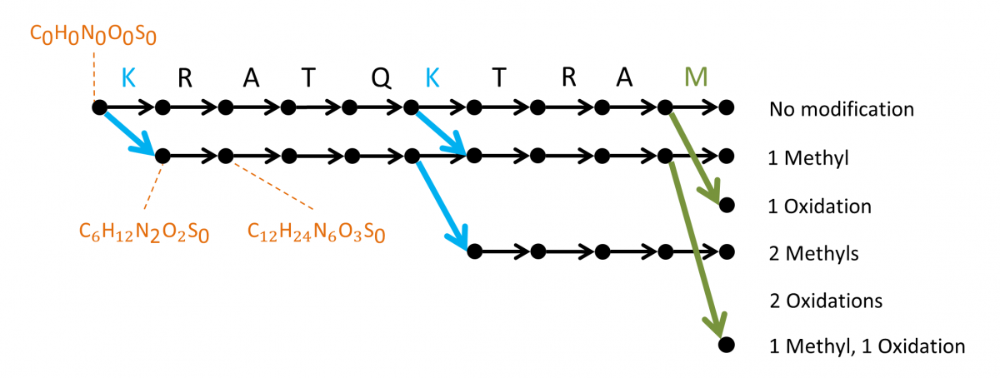

# __MSPathFinder & Informed-Proteomics__
MSPathFinder is a database search engine for top-down proteomics, part of the Informed Proteomics package.

### Description
MSPathFinder is designed to work in conjunction with LC-MS Features derived by ProMex, also part of the Informed Proteomics package (at [GitHub](https://github.com/PNNL-Comp-Mass-Spec/Informed-Proteomics)). Data visualization and inspection is facilitated by a new spectrum viewer, LC-MS Spectator (at [GitHub](https://github.com/PNNL-Comp-Mass-Spec/LCMS-Spectator), also [see website](https://pnnl-comp-mass-spec.github.io/LCMS-Spectator/)), which was designed to handle spectra from larger sequences.

__ProMex__ finds and characterizes putative proteoforms in LC-MS data. ProMex incorporates two key innovations to improve accuracy of feature detection. First, ProMex not only aggregates signals across different charge states but also explicitly uses the LC dimension to aggregate features over elution time. Second, rather than examining individual isotopomer envelopes separately, ProMex measures the likelihood of detected LC-MS features based on the aggregated isotopomer envelope. The output of ProMex is a list of LC-MS features defined by monoisotopic mass, range of charge states, elution-time span, abundance, and likelihood scores.

> ProMex LC-MS Feature Finding: The algorithm begins with clustering isotopomer envelopes across adjacent time and charge state. The initial cluster is refined to accurately determine its elution-time span and range of charge states. After refinement, ProMex calculates the likelihood that the final cluster is an LC-MS feature.

__MSPathFinder__ represents a novel search method for proteomic mass spectrometry data, with an efficient algorithm for high-throughput searching proteoforms with combinations of PTMs and truncations by reducing redundancies to minimize the search space. MSPathFinder efficiently explores the combinatorial proteoform space using a new graph-based approach called the sequence graph, which allows quickly exploring the vast number of possible proteoforms when considering variable PTMs. MSPathFinder outputs results to TSV and to mzIdentML.

> The sequence graph compactly represents all possible proteoforms and facilitates efficient scoring of the search space. Oxidized methionine and methylated lysine are considered as dynamic modifications and up to 2 modifications are allowed per sequence. The graph is constructed from left to right, with the leftmost vertex (source) corresponding to the peptide N-terminus, and each vertex corresponding to a cleaved fragment.

### Software Usability
For basic information about usability, including the installation and tutorial, please [visit here](https://github.com/PNNL-Comp-Mass-Spec/Informed-Proteomics/wiki/MSPathFinder-Tutorial). Detailed information about use requirements and parameters are available at [our wiki](https://github.com/PNNL-Comp-Mass-Spec/Informed-Proteomics/wiki/Home). The installation files are available [here](https://github.com/PNNL-Comp-Mass-Spec/Informed-Proteomics/releases/latest), and the full source code is available [on GitHub](https://github.com/PNNL-Comp-Mass-Spec/Informed-Proteomics).

### Downloads
* [Latest version](https://github.com/PNNL-Comp-Mass-Spec/Informed-Proteomics/releases/latest)
* [Source code on GitHub](https://github.com/PNNL-Comp-Mass-Spec/Informed-Proteomics)

### Acknowledgment

All publications that utilize this software should provide appropriate acknowledgement to PNNL and the Informed-Proteomics GitHub repository and/or publication. However, if the software is extended or modified, then any subsequent publications should include a more extensive statement, as shown in the Readme file for the given application or on the website that more fully describes the application.

### Disclaimer

These programs are primarily designed to run on Windows machines. Please use them at your own risk. This material was prepared as an account of work sponsored by an agency of the United States Government. Neither the United States Government nor the United States Department of Energy, nor Battelle, nor any of their employees, makes any warranty, express or implied, or assumes any legal liability or responsibility for the accuracy, completeness, or usefulness or any information, apparatus, product, or process disclosed, or represents that its use would not infringe privately owned rights.

Portions of this research were supported by the NIH National Center for Research Resources (Grant RR018522), the W.R. Wiley Environmental Molecular Science Laboratory (a national scientific user facility sponsored by the U.S. Department of Energy's Office of Biological and Environmental Research and located at PNNL), and the National Institute of Allergy and Infectious Diseases (NIH/DHHS through interagency agreement Y1-AI-4894-01). PNNL is operated by Battelle Memorial Institute for the U.S. Department of Energy under contract DE-AC05-76RL0 1830.

We would like your feedback about the usefulness of the tools and information provided by the Resource. Your suggestions on how to increase their value to you will be appreciated. Please e-mail any comments to proteomics@pnl.gov
